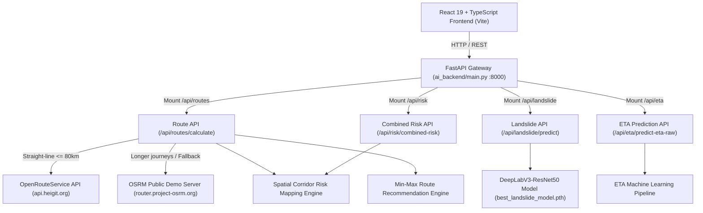

# NAVEXA

> AI-powered regional intelligence for safer logistics and risk-aware route planning in Northeast India.

NAVEXA is an advanced regional intelligence and logistics decision-support platform designed to enhance freight safety, corridor risk visibility, and route planning across Northeast India. By combining hybrid route calculation, spatial corridor hazard mapping, deep learning-based landslide segmentation, and normalized multi-objective route recommendation, NAVEXA empowers operators to select safer transport corridors.

---

## Table of Contents

- [Key Features](#key-features)
- [System Architecture](#system-architecture)
- [Technology Stack](#technology-stack)
- [Project Structure](#project-structure)
- [Installation and Setup](#installation-and-setup)
- [Environment Variables](#environment-variables)
- [API Documentation](#api-documentation)
- [Machine Learning Model](#machine-learning-model)
- [Route Risk and Optimization](#route-risk-and-optimization)
- [Frontend Usage Guide](#frontend-usage-guide)
- [Testing](#testing)
- [Limitations and Disclaimer](#limitations-and-disclaimer)
- [Future Improvements](#future-improvements)

---

## Key Features

- **Interactive Route Calculation**: Calculates driven road routes, travel duration, distance, and full GeoJSON polyline geometry between origin and destination coordinates across Northeast India.
- **Hybrid Routing Engine**: Dynamically routes requests via **OpenRouteService (ORS)** for short journeys ($\le 80\text{ km}$ straight-line distance) and seamlessly switches to the **OSRM public server** for long-distance corridors or as a free automatic fallback.
- **Spatial Corridor Risk Mapping**: Samples route polyline coordinates against regional hazard zones (e.g., Meghalaya plateau, Jowai/NH-6, Nagaland winding sections, Gangtok hill routes) to evaluate segment-level hazard exposure.
- **Multi-Factor Risk Assessment**: Calculates an overall weighted corridor risk score (0 to 100) based on **40% Highway Accident Frequency**, **30% Pavement Condition Index**, and **30% Landslide Slope Exposure**.
- **Normalized Route Optimization**: Evaluates candidate routes using relative min-max feature scaling and provides route recommendations under three assessment modes:
  - **Balanced Assessment**: 40% travel time, 40% risk score, 20% distance.
  - **Risk-First Assessment**: 70% risk score, 20% travel time, 10% distance.
  - **Time-First Assessment**: 60% travel time, 20% risk score, 20% distance.
- **AI Landslide Image Segmentation**: Upload satellite or aerial terrain images (`.jpg`, `.png`, `.tif`, `.tiff`) to perform DeepLabV3-ResNet50 binary segmentation inference.
- **Multi-Layer Terrain Visualizations**: Generates instant Base64 PNG outputs for **Original Image**, **High-Contrast Cyan Binary Mask**, and **Semi-Transparent Red Composite Overlay** matching original image dimensions.
- **Public Transit Bus ETA Prediction Service**: Includes a REST API supporting both pre-processed feature inputs and raw GPS telemetry to calculate bus arrival times based on historical route statistics.
- **Control-Room Editorial Dashboard**: Features a modern dark navy and ice-blue UI built with React 19, TypeScript, TailwindCSS, and Leaflet map rendering, with an integrated Demo Mode toggle.

---

## System Architecture



The system is decoupled into a **React 19 single-page application** and a **FastAPI Gateway**. The gateway dynamically mounts individual microservices (`route_api`, `landslide_app`, `combined_risk_app`, and `eta_app`).

---

## Technology Stack

| Category | Technology | Purpose in NAVEXA |
| --- | --- | --- |
| **Frontend Framework** | React 19 | Modular UI components and application state |
| **Frontend Language** | TypeScript 5.6 | Strict typing across API models and components |
| **Build Tool** | Vite 7 | High-speed HMR dev server & Rollup bundler |
| **Styling & Design** | Tailwind CSS 4 & Lucide Icons | Control-room dark/light design system & icons |
| **Mapping & GIS** | Leaflet & React-Leaflet 5 | Interactive map rendering and polyline overlays |
| **Backend Gateway** | FastAPI (Python 3.10+) | High-performance async REST API Gateway |
| **Deep Learning** | PyTorch & Torchvision | DeepLabV3-ResNet50 segmentation inference |
| **Image Processing** | Pillow (PIL) & NumPy | TIFF/PNG conversion & array mask scaling |
| **Machine Learning** | Scikit-Learn, Joblib, Pandas | Tabular accident prediction & ETA inference |
| **Routing Services** | OpenRouteService & OSRM | Hybrid directions, geometry & distance thresholding |
| **HTTP Client** | HTTPX & Fetch API | Async external API requests & backend integration |

---

## Project Structure

```
D:/Kashyap_SIH/
├── ai_backend/                       # Unified FastAPI Backend Gateway & ML Services
│   ├── main.py                       # API Gateway mounting /api/routes, /api/landslide, /api/risk, /api/eta
│   ├── route_api.py                  # Hybrid routing (ORS + OSRM) & spatial corridor risk integration
│   ├── eta_model/                    # Bus ETA Prediction REST Service & Datasets
│   │   ├── predict_api.py            # ETA REST endpoints (/predict-eta, /predict-eta-raw)
│   │   ├── predict.py                # Core ETA prediction logic
│   │   └── data/                     # Route stops & historical telemetry CSV datasets
│   ├── landslide_model/              # AI Landslide Image Segmentation Engine
│   │   ├── best_landslide_model.pth  # Trained DeepLabV3-ResNet50 PyTorch checkpoint (~168 MB)
│   │   ├── model.py                  # PyTorch model definition (2-class segmentation)
│   │   ├── predict_api.py            # Landslide API (/predict, /convert-image, /health)
│   │   └── predict.py                # Standalone CLI image inference script
│   ├── risk_model/                   # Spatial Risk Engine & Optimization
│   │   ├── combined_risk_api.py      # Multi-factor risk API endpoint (/combined-risk)
│   │   ├── combined_risk_engine.py   # Multi-factor risk calculation logic
│   │   ├── corridor_risk_engine.py   # Regional Northeast India spatial hazard mapping engine
│   │   ├── route_optimizer.py        # Relative min-max route feature normalization
│   │   ├── risk_model.pkl            # Pre-trained tabular accident severity model
│   │   └── train_risk_model.py       # Scikit-learn Random Forest model training script
│   └── road_model/                   # Pavement condition index & road damage modules
├── frontend/                         # Frontend Root Directory
│   ├── package.json                  # Frontend scripts and root dependencies
│   └── client/                       # React 19 + Vite Application Source
│       ├── index.html                # Main HTML entry with NAVEXA title & meta
│       ├── src/
│       │   ├── App.tsx               # Main routing & notification provider setup
│       │   ├── components/           # Core components (InteractiveRouteMap, AppShell, BrandMark)
│       │   ├── pages/                # Page views (Dashboard, RouteAnalysis, LandslideDetection, About)
│       │   └── services/             # API clients (api.ts, landslideApi.ts)
│       └── vite.config.ts            # Vite build configuration and path aliases
├── .env                              # Backend environment variables (ORS_API_KEY)
└── README.md                         # Project documentation
```

---

## Installation and Setup

### Prerequisites
- **Python**: 3.10 or higher
- **Node.js**: 18.0 or higher
- **pnpm / npm**: Package manager installed

### 1. Clone & Enter Project Directory
```powershell
cd D:\Kashyap_SIH
```

### 2. Backend Setup
Create and activate a Python virtual environment:
```powershell
python -m venv .venv
.venv\Scripts\activate
```

Install the backend dependencies:
```powershell
pip install fastapi uvicorn torch torchvision pillow numpy pandas httpx joblib scikit-learn python-dotenv
```

### 3. Frontend Setup
Navigate to the frontend directory and install dependencies:
```powershell
cd frontend
pnpm install
```

### 4. Running the Application

**Step A: Start the FastAPI Backend Gateway**
From the project root (with `.venv` activated):
```powershell
python -m uvicorn ai_backend.main:app --reload --host 127.0.0.1 --port 8000
```
*Backend will run at: `http://127.0.0.1:8000`*

**Step B: Start the Frontend Development Server**
In a separate terminal (from `D:\Kashyap_SIH\frontend`):
```powershell
pnpm dev
```
*Frontend will run at: `http://localhost:3000` (or `http://localhost:5173`)*

---

## Environment Variables

Create a `.env` file in the root project directory (`D:\Kashyap_SIH\.env`):

```env
# OpenRouteService API Key for short-distance route calculations
ORS_API_KEY=your_openrouteservice_api_key_here
```

Frontend Environment Configuration (optional override):
```env
VITE_API_BASE_URL=http://127.0.0.1:8000
VITE_ROUTE_GENERATION_URL=http://127.0.0.1:8000/api/routes/calculate
```

> **Note**: If `ORS_API_KEY` is omitted or an error occurs during an ORS request, the backend automatically falls back to the public **OSRM** service to ensure uninterrupted route generation.

---

## API Documentation

Interactive Swagger documentation is available at:
- **Gateway Swagger Docs**: `http://127.0.0.1:8000/docs`

### Key Endpoints Overview

| Method | Endpoint | Purpose |
| --- | --- | --- |
| `GET` | `/` | API Gateway status and service registry |
| `GET` | `/health` | Health status check for all backend microservices |
| `POST` | `/api/routes/calculate` | Calculates routes, evaluates corridor risks, and returns recommendations |
| `POST` | `/api/landslide/convert-image` | Converts TIFF/PNG/JPG images to Base64 PNG for instant browser preview |
| `POST` | `/api/landslide/predict` | Runs DeepLabV3 landslide segmentation and returns mask & overlay |
| `POST` | `/api/risk/combined-risk` | Evaluates multi-factor risk scores from individual risk components |
| `POST` | `/api/eta/predict-eta-raw` | Computes bus ETA in minutes directly from raw GPS telemetry |

### Route Calculation Request Example (`POST /api/routes/calculate`)

```json
{
  "origin": { "lat": 26.1445, "lng": 91.7362 },
  "destination": { "lat": 25.5788, "lng": 91.8933 },
  "alternative_count": 2,
  "analysis_mode": "Balanced assessment"
}
```

### Route Calculation Response Summary

```json
{
  "status": "success",
  "origin": { "lat": 26.1445, "lng": 91.7362 },
  "destination": { "lat": 25.5788, "lng": 91.8933 },
  "estimated_straight_line_distance_km": 68.32,
  "provider_used": "openrouteservice",
  "route_count": 2,
  "recommended_route": {
    "route_id": "route_1",
    "provider": "openrouteservice",
    "distance_km": 98.4,
    "duration_minutes": 154.2,
    "risk_score": 42.15,
    "risk_category": "Medium",
    "calculated_score": 34.50
  },
  "routes": [...]
}
```

---

## Machine Learning Model

### Landslide Image Segmentation Model
- **Model Architecture**: DeepLabV3 with a **ResNet-50** backbone (`torchvision.models.segmentation.deeplabv3_resnet50`).
- **Checkpoint Location**: [`ai_backend/landslide_model/best_landslide_model.pth`](file:///d:/Kashyap_SIH/ai_backend/landslide_model/best_landslide_model.pth) (~168 MB).
- **Task Type**: Binary Semantic Image Segmentation (Class 0: Background/Terrain, Class 1: Landslide/Slope Failure).
- **Input Preprocessing**: Input images are converted to RGB, resized to $512 \times 512$ pixels, and converted to PyTorch Tensors.
- **Output Visualizations**:
  1. **Original Image**: Converted into browser-compatible Base64 PNG.
  2. **High-Contrast Mask**: Cyan ($RGB: [0, 225, 255]$) binary prediction mask.
  3. **Semi-Transparent Overlay**: Alpha-blended red overlay ($RGBA: [255, 0, 0, 140]$) composite.
- **Output Metrics**: Landslide pixel count, coverage percentage (%), model prediction confidence (%), and risk classification (`Low`, `Medium`, `High`).

> **Model Disclaimer**: Output maps represent experimental deep learning inference on aerial terrain imagery and are not certified live disaster forecasts.

---

## Route Risk and Optimization

### 1. Spatial Corridor Mapping (`corridor_risk_engine.py`)
Routes are evaluated by sampling coordinates along their polyline geometry against regional Northeast India hazard profiles:
- **Shillong / Meghalaya Plateau**: High landslide & rainfall slope exposure.
- **Jowai / NH-6 Freight Corridor**: Heavy freight traffic & severe road damage risk.
- **Kohima & Gangtok Corridors**: Winding Himalayan terrain & landslide risk.
- **Guwahati Interchange**: High urban highway accident frequency.

### 2. Multi-Factor Risk Calculation
$$\text{Overall Risk Score} = (0.40 \times \text{Accident Risk}) + (0.30 \times \text{Road Damage Score}) + (0.30 \times \text{Landslide Exposure})$$

### 3. Min-Max Feature Normalization (`route_optimizer.py`)
To prevent travel time or distance values from dominating risk scores, feature values ($t$, $d$, $r$) are scaled relative to min/max values across available candidate routes into a standardized 0–100 scale:

$$\text{Normalized Value} = \frac{v - v_{\min}}{v_{\max} - v_{\min}} \times 100$$

The recommended route is selected by minimizing the overall weighted score based on the chosen **Analysis Mode**.

---

## Frontend Usage Guide

1. **Dashboard Overview**: Access the control-room dashboard for a high-level summary of active corridors, emergency alerts, and model transparency metrics.
2. **Calculate Route**:
   - Navigate to **Route Analysis**.
   - Select Origin (e.g., *Guwahati*) and Destination (e.g., *Shillong*).
   - Choose an Analysis Mode (*Balanced*, *Risk-First*, or *Time-First*).
   - Click **Analyze Route**.
3. **Interactive Route Map**: View recommended (Cyan), selected (Blue), and alternative (Green) routes on the Leaflet map with detailed hover tooltips.
4. **Landslide Detection**:
   - Navigate to **Landslide Detection**.
   - Drag & drop or browse for a terrain image (supports `.jpg`, `.png`, `.tif`, `.tiff`).
   - Click **Analyze for Landslides**.
   - Toggle between **Original**, **Mask**, and **Overlay** views to inspect predicted landslide regions.

---

## Testing

### Verified Verification Commands

- **Backend API & Endpoint Health Check**:
  ```powershell
  python -m unittest ai_backend/risk_model/test_combined_risk.py
  ```
- **ETA Pipeline Verification**:
  ```powershell
  python ai_backend/test_eta_pipeline.py
  ```
- **Frontend TypeScript Verification**:
  ```powershell
  cd frontend/client
  npx tsc --noEmit
  ```
- **Vite Production Build Test**:
  ```powershell
  cd frontend
  pnpm build
  ```

---

## Limitations and Disclaimer

- **Experimental Decision-Support Prototype**: NAVEXA is developed as a hackathon decision-support prototype. It is **not** a certified emergency warning system or a replacement for official disaster management authorities.
- **Regional Estimates**: Corridor risk scores combine geometry-sampled hazard profiles with static regional assumptions for Northeast India corridors.
- **Routing API Dependencies**: Route calculations depend on OpenRouteService API availability and OSRM public demo server rate limits.

---

## Future Improvements

- [ ] Integration of real-time IMD weather and satellite rainfall data feeds.
- [ ] Integration of verified GIS geospatial hazard layers (e.g., GSI landslide susceptibility maps).
- [ ] Model calibration and quantitative accuracy reporting on expanded benchmark datasets.
- [ ] Turn-by-turn hazard alert notifications for commercial vehicle drivers.
- [ ] Real-time traffic congestion monitoring.

---

## License

This project is released for evaluation and demonstration purposes. Licensing details are subject to project owner decisions.
